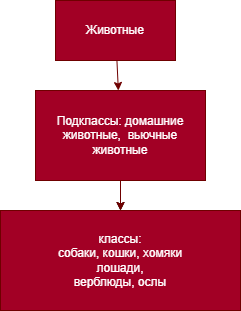

# 1. Используя команду cat в терминале операционной системы Linux, создать два файла Домашние животные (заполнив файл собаками, кошками, хомяками) и Вьючные животными заполнив файл Лошадьми, верблюдами и ослы), а затем объединить их. Просмотреть содержимое созданного файла. Переименовать файл, дав ему новое имя (Друзья человека).

cat  > Домашние_животные.txt
cat  > Вьючные_животные.txt
cat Домашние_животные.txt Вьючные_животные.txt  > tmp.txt
cat tmp.txt
mv tmp.txt Друзья_человека.txt

# 2. Создать директорию, переместить файл туда. 

mkdir tmp
mv Друзья_человека.txt tmp
ls -l tmp

# 3. Подключить дополнительный репозиторий MySQL. Установить любой пакет из этого репозитория. 

sudo apt install mysql-server-8.0
ss –tnlp
sudo mysql

# 4. Установить и удалить deb-пакет с помощью dpkg. 

sudo wget http://archive.ubuntu.com/ubuntu/pool/universe/g/gimp/gimp_2.10.30-1build1_amd64.deb
sudo dpkg -i gimp_2.10.30-1build1_amd64.deb
sudo apt -f install
sudo dpkg -r gimp

# 6. Нарисовать диаграмму, в которой есть класс родительский класс, домашние животные и вьючные животные, в составы которых в случае домашних животных войдут классы: собаки, кошки, хомяки, а в класс вьючные животные войдут: Лошади, верблюды и ослы). 

 

# [Задания 7-12](https://github.com/Luibov052022/ControlWork2/blob/main/Z7-12.sql)

# [Задания 13-14](https://github.com/Luibov052022/ControlWork2/tree/main/Java)
